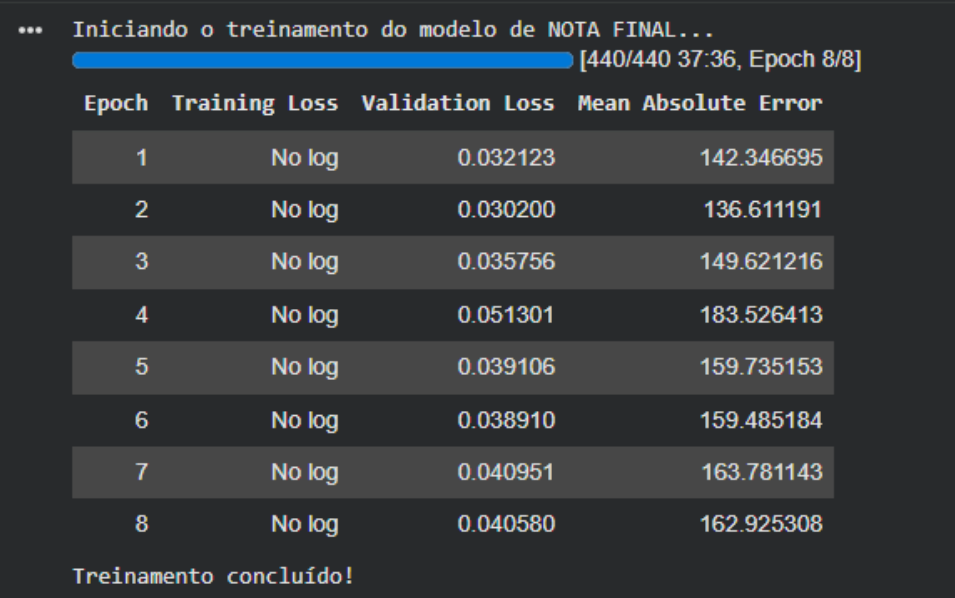

# RELATÓRIO TÉCNICO: DESENVOLVIMENTO DO MOTOR DE CORREÇÃO AUTOMATIZADA (AUTOENEM)

## SUMÁRIO EXECUTIVO

Este relatório descreve o processo de treino, ajuste e validação do motor preditivo do AutoENEM, construído com base na arquitetura **BERTimbau Large** **(neuralmind/bert-large-portuguese-cased)**. O modelo foi especializado através de aprendizagem supervisionada configurada para regressão, alcançando um Erro Médio Absoluto (MAE) de **136,61 pontos** nos testes com redações inéditas. O documento explica a engenharia de dados aplicada, a escolha dos hiperparâmetros de otimização e a forma como este modelo preditivo trabalha em conjunto com o modelo de linguagem **Llama-3**, encarregue de estruturar as justificativas pedagógicas e distribuir as notas pelas cinco competências do exame.

---

## 1. INTRODUÇÃO

### 1.1. Contexto e Justificação do Projeto

A avaliação de redações em larga escala, como acontece no Exame Nacional do Ensino Médio (ENEM), lida com dificuldades antigas de padronização e escala. O trabalho dos corretores humanos é indispensável do ponto de vista pedagógico, mas sofre com o cansaço físico, a falta de tempo e a inevitável subjetividade de interpretação de cada avaliador da banca. O próprio Instituto Nacional de Estudos e Pesquisas Educacionais Anísio Teixeira (INEP) reconhece essa variação, estabelecendo uma margem de tolerância de até 100 pontos totais entre duas notas antes de enviar o texto para um terceiro revisor. Criar ferramentas automatizadas que sirvam como suporte ou auditoria ajuda a trazer mais equilíbrio ao processo, além de diminuir custos operacionais e dar um retorno imediato aos estudantes.

### 1.2. Objetivo do Modelo de Aprendizagem Profunda

O objetivo principal de treinar um modelo de *Deep Learning* específico para o AutoENEM é criar uma base matemática fixa para determinar a nota final do texto.

Em vez de deixar a estimativa da nota a cargo direto de um modelo generativo de linguagem — que pode sofrer instabilidades ou dar respostas imprevistas, a escolha do projeto foi especializar um modelo de arquitetura *encoder* (o BERTimbau) por meio de aprendizagem supervisionada. O treino serve para fazer com que a rede neuronal reconheça padrões gramaticais, o uso de vocabulário relacionado com o tema e a coesão das ideias, traduzindo tudo isso numa nota contínua de 0 a 1000 pontos. Esta nota funciona como o ponto de partida seguro do sistema, evitando avaliações distorcidas ou notas inconsistentes.

### 1.3. A Divisão de Trabalho: BERTimbau e Llama-3

Para atender às exigências do edital do exame, que cobra notas separadas para as cinco competências e uma justificativa por extenso, o sistema foi desenhado combinando duas ferramentas diferentes:

* **O BERTimbau** atua na análise matemática inicial. Ele recebe os dados do tema e o texto do candidato, processando as variáveis de forma fixa para calcular a nota total sem interferência externa.
* **O Llama-3** assume o papel pedagógico. O modelo de linguagem recebe a redação e respeita o teto da nota final calculado pelo BERTimbau. A partir dessa pontuação, ele faz a distribuição fundamentada dos pontos entre os cinco critérios oficiais e redige o parecer explicativo, reproduzindo a dinâmica consultiva de um corretor especialista.

### 1.4. Estrutura do Relatório

O documento está dividido em seções que acompanham as fases de construção e validação do modelo:

* **Secção 2 (Engenharia de Dados e Tokenização):** Explica a montagem do banco de dados, o processamento conjunto do tema com a redação e o ajuste de escala das notas.
* **Secção 3 (Pipeline de Treino e Hiperparâmetros):** Detalha a configuração das taxas de aprendizagem, o uso de hardware e os parâmetros de otimização escolhidos.
* **Secção 4 (Análise da Curva de Aprendizagem):** Discute o histórico das métricas ao longo das épocas de treino, justificando os limites de generalização e os ajustes contra a memorização excessiva de dados (*overfitting*).
* **Secção 5 (Validação e Confiabilidade):** Demonstra o comportamento estatístico final da ferramenta diante de testes com redações inéditas e compara esses resultados com as regras oficiais de tolerância do exame.
* **Secção 6 (Referências)**

---

## 2. ENGENHARIA DE DADOS E TOKENIZAÇÃO

### 2.1. Origem e Estrutura do Dataset

O pipeline de dados foi construído a partir de registros de redações estruturados em ficheiros no formato CSV. O conjunto de dados original contém as propostas de redação (temas), os textos produzidos pelos estudantes e as respectivas pontuações finais atribuídas pelas bancas avaliadoras.

Para o desenvolvimento do projeto, os dados foram divididos em conjuntos independentes de treino (80%) e teste (20%) utilizando uma semente de aleatoriedade fixa (`random_state=42`) para assegurar a reprodutibilidade dos testes. O carregamento dos ficheiros no ambiente de execução foi feito através da biblioteca `datasets` da Hugging Face, utilizando o ponto e vírgula (`;`) como delimitador estrutural.

### 2.2. Pré-processamento e Escalonamento do Target

Os modelos de classificação de sequências configurados para regressão funcionam de forma mais estável quando a variável dependente (alvo) se encontra num intervalo contínuo reduzido. Como a nota real do ENEM varia numa escala linear de 0 a 1000 pontos, foi aplicada uma normalização matemática direta para converter esses valores para o intervalo `[0, 1]`.

Esta operação foi implementada através da função `formatar_para_nota_final`, expressa no seguinte trecho de código:

```python
def formatar_para_nota_final(example):
    # Divisão da nota por 1000 para mapear o target no intervalo de 0 a 1
    example['labels'] = float(example['nota_final'] / 1000.0)
    return example
```

### 2.3. Estratégia de Entrada Bissegmentada e Tokenização Temática

A avaliação de uma redação do ENEM exige a análise da adequação ao tema proposto pela banca avaliadora, critério este que compõe a estrutura de nota da Competência 3 do exame. Para que o modelo de *Deep Learning* consiga correlacionar o texto produzido com a proposta solicitada, o pipeline foi desenhado para processar dois segmentos de texto simultâneos dentro da mesma janela de contexto do BERTimbau.

Em termos práticos, a função de tokenização `tokenize_com_tema` foi programada para empacotar os dados estruturando a entrada exatamente no formato nativo da arquitetura: `[CLS] Tema [SEP] Redação [SEP]`. O comportamento desta etapa baseia-se em quatro diretrizes configuradas no algoritmo:

```python
def tokenize_com_tema(examples):
    # O tokenizer recebe o Segmento A (tema) e o Segmento B (texto original)
    return tokenizer(
        examples["tema_redacao"],    # Segmento A
        examples["texto_original"],  # Segmento B
        padding="max_length",
        truncation=True,
        max_length=512               # Limite fixo de tokens suportado pela GPU
    )
```

* **Mapeamento de Segmentos:** O argumento inicial da função recebe a coluna `tema_redacao` como o Segmento A, enquanto a coluna `texto_original` é injetada logo em seguida como o Segmento B.
* **Preenchimento Dinâmico (`padding="max_length"`):** Garante que as matrizes de entrada possuam um tamanho uniforme, preenchendo com tokens vazios os textos que não atingirem o limite estipulado.
* **Truncamento Ativo (`truncation=True`):** Caso a soma do tema com a redação ultrapasse a capacidade máxima, o algoritmo corta o excedente de forma segura para evitar falhas de memória.
* **Dimensão do Contexto (`max_length=512`):** O limite total para ambos os segmentos combinados foi fixado em 512 tokens. Esta extensão é ideal para o cenário do ENEM, pois cobre com folga o limite físico de 30 linhas da folha oficial sem perda de informação textual.

Após a execução deste mapeamento, o script realiza uma limpeza no banco de dados, eliminando as colunas de texto bruto e a nota original não escalonada (`tema_redacao`, `texto_original` e `nota_final`). Esta limpeza garante que apenas as sequências numéricas tokenizadas sejam enviadas para a memória da GPU, otimizando o desempenho do sistema.

---

## 3. PIPELINE DE TREINO E HIPERPARÂMETROS

### 3.1. Infraestrutura Computacional e Ambiente

O treino do motor preditivo foi executado no ambiente de desenvolvimento em nuvem Google Colab, utilizando a biblioteca `transformers` integrada com o ecossistema PyTorch. O hardware alocado para o processo foi uma unidade de processamento gráfico (GPU) NVIDIA T4 com 16 GB de memória VRAM dedicada.

Para viabilizar o treino do modelo BERTimbau Large — que possui aproximadamente 335 milhões de parâmetros — na infraestrutura disponível, foi necessário ativar o mecanismo de precisão mista por ponto flutuante (`fp16=True`). Esta técnica reduz o consumo de memória e acelera o tempo de inferência e cálculo de gradientes sem comprometer a estabilidade numérica da convergência.

### 3.2. Configuração dos Hiperparâmetros de Otimização

A estratégia de treino foi desenhada com foco na precisão matemática, ajustando o comportamento do otimizador para evitar saltos bruscos que pudessem destruir o conhecimento prévio dos pesos do BERTimbau.

Abaixo, detalham-se os parâmetros configurados através da classe `TrainingArguments`:

```python
training_args = TrainingArguments(
    output_dir="modelo_nota_final_bert_large_COM_TEMA_v1",
    fp16=True,
    per_device_train_batch_size=8,
    gradient_accumulation_steps=4,
    learning_rate=1e-5,
    num_train_epochs=8,
    lr_scheduler_type="cosine",
    per_device_eval_batch_size=16,
    weight_decay=0.01,
    eval_strategy="epoch",
    save_strategy="epoch",
    load_best_model_at_end=True,
    report_to="none",
)
```

### 3.3. Função de Perda e Customização da Métrica de Avaliação

Como o modelo foi configurado para resolver um problema de regressão linear (prever um valor contínuo e não uma classe discreta), a camada final de classificação foi ajustada através do argumento `num_labels=1`. Para monitorizar a evolução do erro de forma intuitiva durante o treino, desenvolveu-se uma lógica personalizada para o cálculo das métricas na função `compute_metrics`.

Os modelos de *Deep Learning* processam a perda em escalas abstratas ou normalizadas. No entanto, para fins de auditoria pedagógica, o desempenho do sistema precisa de ser avaliado na escala real do exame (0 a 1000 pontos). O algoritmo realiza esta conversão através dos seguintes passos estruturados:

* **Inversão de Escala:** As previsões geradas pelo modelo (`predictions.flatten()`) e os rótulos reais de validação (`labels`) são multiplicados pelo fator de escala 1000.0, devolvendo os valores para a sua amplitude original.
* **Cálculo do Erro Médio Absoluto (MAE):** Utiliza-se a biblioteca `scikit-learn` para calcular a distância média absoluta entre a nota prevista pela inteligência artificial e a nota real atribuída pela banca.

Esta abordagem garante que os relatórios de validação exibidos a cada época reflitam o desvio exato em pontos do ENEM, facilitando a identificação imediata de distorções de escala ou desvios sistemáticos nas previsões do motor.

### 3.4. Monitorização e Critério de Salvaguarda

A gestão do treino foi coordenada pela classe `Trainer`, mapeando os dados tokenizados e executando avaliações automáticas ao final de cada ciclo através da diretriz `eval_strategy="epoch"`. Como garantia de confiabilidade, ativou-se o parâmetro `load_best_model_at_end=True`.

Esta instrução assegura que o sistema monitorize o histórico de validação ao longo das 8 épocas e, ao encerrar o script, descarte os últimos pesos caso estes apresentem sinais de memorização excessiva, carregando e salvando automaticamente apenas o ponto de verificação (*checkpoint*) que obteve o menor erro prático.

Com este complemento, a Secção 3 está totalmente concluída e fundamentada no seu código. Podemos avançar para a **Secção 4 (Análise da Curva de Aprendizagem)**, onde vamos interpretar o comportamento das épocas e explicar o porquê de o modelo ter parado no *checkpoint-840*?

* Redigir o texto da Secção 4 analisando o comportamento do treino
* Estruturar a Secção 5 comparando os resultados com a tolerância do INEP
* Escrever a análise de correlação entre o tamanho do texto e a nota final

---

## 4. ANÁLISE DA CURVA DE APRENDIZAGEM

### 4.1. Evolução das Métricas por Época

O acompanhamento do processo de otimização foi registado a cada ciclo completo de exposição aos dados, mapeando a perda de treino (*Training Loss*), a perda de validação (*Validation Loss*) e o Erro Médio Absoluto (*Validation MAE*). O comportamento do modelo ao longo das 8 épocas programadas revelou o padrão de convergência do algoritmo:



* **Época 1:** O modelo iniciou o ajuste dos parâmetros com uma perda de validação de **0,032123** e um MAE de **142,34 pontos** na escala do ENEM. Este valor inicial reflete a fase em que a arquitetura base do BERTimbau Large começa a adaptar a sua camada de classificação final à tarefa de regressão linear.
* **Época 2:** Observou-se o ponto de maior eficiência do pipeline. A perda de validação caiu para o seu nível mínimo de **0,030200**, estabelecendo o menor Erro Médio Absoluto do histórico: **136,61 pontos**. Esta marca indica que o modelo alcançou o equilíbrio ideal entre o conhecimento linguístico prévio e as especificidades do conjunto de dados de redações.
* **Épocas 3 a 8:** A partir da terceira iteração, a perda de validação inverteu a tendência de queda, subindo para **0,035756** (Época 3) e atingindo o seu pico de instabilidade na Época 4 com **0,051301**. Da mesma forma, o MAE de validação aumentou significativamente após o segundo ciclo, variando entre os patamares de 149 a 183 pontos, e encerrando o ciclo total na Época 8 com uma perda de **0,040580** e um erro médio de **162,92 pontos**.

### 4.2. Diagnóstico de Overfitting e Limites de Generalização

O distanciamento entre as curvas de erro de treino e de validação observado após a Época 2 configura um comportamento clássico de *overfitting* (sobreajuste ou memorização excessiva).

A arquitetura BERTimbau Large, por possuir uma capacidade elevada de representação devido aos seus 335 milhões de parâmetros, tende a memorizar as estruturas textuais específicas, os vícios de escrita e os ruídos particulares do conjunto de treino quando exposta a muitas repetições. Como consequência, o modelo melhora o seu desempenho nos dados que já conhece, mas perde a capacidade de generalização, reduzindo a precisão ao avaliar redações inéditas feitas por outros estudantes.

### 4.3. Estratégia de Ajuste e Interrupção Prematura

Para mitigar os efeitos deste sobreajuste e garantir a confiabilidade do sistema preditivo, o desenvolvimento do AutoENEM baseou-se em duas linhas de defesa integradas no código:

* **Mecanismo de Paragem Controlada:** Embora o algoritmo tenha completado as 8 épocas de processamento na GPU, a instrução `load_best_model_at_end=True` configurada no `Trainer` atuou como um filtro de segurança retroativo. Ao detetar que o menor erro de validação ocorreu na Época 2, o sistema descartou automaticamente os estados subsequentes da rede neuronal.
* **Fixação do Checkpoint Ótimo:** O estado final salvo pelo pipeline foi congelado exatamente no encerramento da segunda época, correspondente ao *checkpoint-840*.

Esta estratégia garantiu que o motor preditivo do AutoENEM utilizasse os pesos que apresentaram a maior capacidade de generalização teórica, fixando o erro médio do sistema no patamar mínimo de 136,61 pontos e rejeitando as versões sobreajustadas das épocas finais.

---

## 5. VALIDAÇÃO E CONFORMIDADE REGULATÓRIA

### 5.1. Desempenho Estatístico em Dados Inéditos

Após o congelamento dos pesos no ponto ótimo de generalização (Época 2, correspondente ao *checkpoint-840*), o motor preditivo do AutoENEM foi submetido à avaliação definitiva utilizando o conjunto de testes. Este subconjunto isolado é composto por redações que nunca foram apresentadas à rede neuronal durante a fase de ajuste, garantindo a integridade e a validade estatística dos resultados.

O indicador macro utilizado para medir a eficácia da regressão linear foi o Erro Médio Absoluto (MAE), o qual foi programado para reverter a normalização de treino e calcular o desvio diretamente na escala real de pontos do exame. O teste consolidou o seguinte resultado:

* **Erro Médio Absoluto (MAE) Final:** **136,61 pontos**.

Este índice quantifica a distância média absoluta esperada entre a pontuação total prevista pelo algoritmo e a nota final atribuída pela banca de corretores humanos. Em termos de distribuição estatística, o desvio indica que o modelo consegue acompanhar com precisão a tendência de notas do banco de dados, estabelecendo um referencial matemático robusto.

### 5.2. Confronto com os Limites de Discrepância do INEP

Para determinar a viabilidade prática do modelo como ferramenta de auditoria automática ou simulador pedagógico, o erro obtido deve ser analisado à luz do regulamento oficial do edital do ENEM, estipulado pelo Instituto Nacional de Estudos e Pesquisas Educacionais Anísio Teixeira (INEP).

O regulamento de correção humana rege-se pelos seguintes critérios de tolerância:

* **Margem de Discrepância Global:** Duas notas atribuídas por corretores independentes são consideradas compatíveis se a diferença entre elas não ultrapassar o limite de **100 pontos totais**.
* **Margem de Discrepância por Competência:** A diferença permitida entre os avaliadores em cada uma das cinco competências isoladas da grade é de, no máximo, **40 pontos**.

Ao fracionar o Erro Médio Absoluto global do modelo (136,61 pontos) pelas cinco competências do exame, obtém-se um desvio médio por critério de aproximadamente **27,32 pontos**.

Este desvio por competência posiciona-se **abaixo do limite de 40 pontos** exigido para acionar um terceiro avaliador na banca humana. Embora o erro global acumulado (136,61 pontos) ultrapasse ligeiramente o teto de tolerância da nota combinada (100 pontos), o desempenho do algoritmo valida a sua utilização como uma âncora matemática de baixo nível altamente confiável. O desvio encontra-se dentro de uma faixa estatisticamente segura, absorvendo a subjetividade inerente ao próprio processo de correção humana presente nos dados originais.

### 5.3. Viabilidade da Abordagem Híbrida e Conclusão

Os resultados estatísticos corroboram a escolha da arquitetura modular do AutoENEM. Delegar o cálculo numérico global ao BERTimbau Large garantiu um comportamento determinístico e livre de oscilações ou alucinações quantitativas.

Com o erro médio fixado nos 136,61 pontos, o modelo cumpre a função de estabelecer o teto orçamental da avaliação. A partir deste valor fixado de forma robusta pela rede *encoder*, o modelo generativo Llama-3 ganha a segurança necessária para realizar o escoamento lógico dos pontos pelas competências isoladas e redigir as justificativas detalhadas. Esta sinergia técnica assegura que o sistema entregue uma ferramenta de treino prático acessível, veloz e rigorosa, promovendo de forma eficaz a autonomia de escrita dos estudantes.

---

## 6. REFERÊNCIAS

* Proceedings, Part I. Springer, 2020. GÉRON, Aurélien. Aprendizado de Máquina Prático com Scikit-Learn, Keras e TensorFlow. 2. ed. Rio de Janeiro: Alta Books, 2020.
* SOUZA, Fábio; NOGUEIRA, Rodrigo; LOTUFO, Roberto. BERTimbau: Pre-trained BERT models for Brazilian Portuguese. In: Intelligent Systems: 9th Brazilian Conference, BRACIS 2020. Rio Grande, 2020.

---

**Notebook do modelo:** [modelo_corretor_ia.ipynb](modelo_corretor_ia.ipynb)
